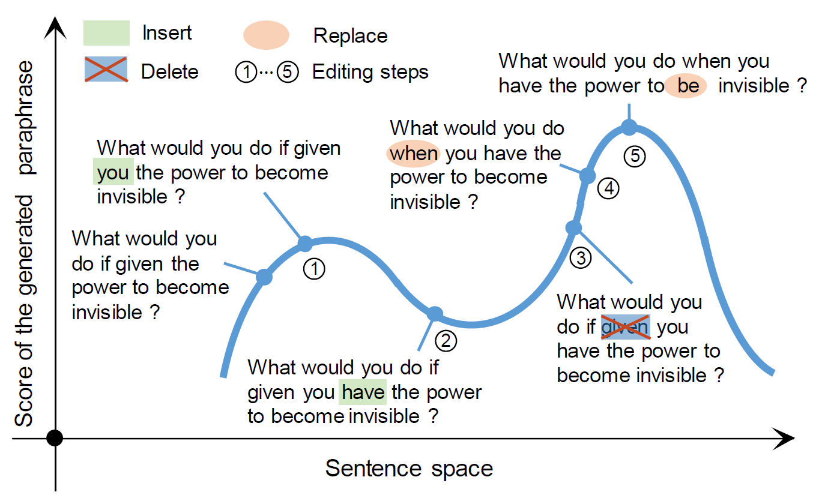

# UPSA

# Requirement
python==3.7
cuda 9.0
## python packages
	nltk
	TensorFlow == 1.15.0
	numpy
	pickle
	Rake (pip install python-rake)
	zpar (pip install python-zpar, download model file from https://github.com/frcchang/zpar/releases/download/v0.7.5/english-models.zip and extract it to POS/english-models)


# run the code:
```bash
python -W ignore::UserWarning source/run.py --exps_dir exps-sampling  --exp_name  test   --use_data_path data/quoradata/test.txt --mode kw-bleu  --N_repeat 1  --save_path sa.txt   --batch_size 1 --gpu 0  --search_size 50

python -W ignore::UserWarning source/run.py --exps_dir exps-sampling  --exp_name  test   --use_data_path data/quoradata/c_origin.txt --mode kw-bleu  --N_repeat 1  --save_path sa.txt   --batch_size 1 --gpu 0  --search_size 50
```

# evaluation script
```bash
python  source/evaluate.py --reference_path quora-results/ref.txt --input_path data/quoradata/c_origin.txt --generated_path quora-results/gen.txt
```

# Cite this paper
```bash
@inproceedings{UPSA,
title="Unsupervised Paraphrasing by Simulated Annealing",
author="Xianggen Liu, Lili Mou, Fandong Meng, Hao Zhou, Jie Zhou, Sen Song",
year = "2020",
booktitle="ACL"
}
```
